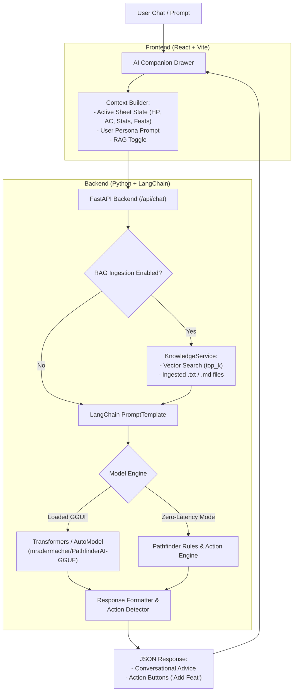

# ⚔️ Pathfinder 2e Character Forge & AI Studio

<div align="center">

[](https://python.org)
[](https://reactjs.org/)
[](https://langchain.com)
[](https://huggingface.co/mradermacher/PathfinderAI-GGUF)
[-success.svg?logo=shield&logoColor=white)](https://pypi.org/project/pip-audit/)
[](https://docker.com)
[](LICENSE)

**A next-generation Pathfinder 2nd Edition (Remaster) Character Builder and AI Co-Pilot.**  
Combines the iconic interface of **Pathbuilder 2e** with local AI reasoning powered by **LangChain**, **Hugging Face Transformers**, and **RAG Knowledge Ingestion** from custom text files.

[Features](#-key-features) • [System Specs](#-system-requirements--minimum-specs) • [Setup Instructions](#-setup--installation-instructions) • [AI Architecture](#-ai--langchain-architecture) • [Custom Training (RAG)](#-adding-custom-training-from-text-files) • [API Docs](#-api-endpoints) • [License & Model References](#-licensing-model-references--legal-notices)

</div>

---

## 🌟 Key Features

### 1. 🛡️ Authentic Pathbuilder 2e Interface
- **Top Status Ribbon**: Live AC breakdown, Hit Points (with rapid `+1`, `+5`, `-1`, `-5` controls and 8-Hour Rest recovery), Perception check, Saving Throws (Fortitude, Reflex, Will), Speed, and Hero Points.
- **`[Sheet]` Live Tabletop Sheet**:
  - 6 Ability Scores with auto-calculated modifiers and boost breakdowns.
  - Strikes & Attacks with automated **Multiple Attack Penalty (MAP)** rolls:
    - **1st Strike** (Full bonus)
    - **2nd MAP** (-5 or -4 for Agile weapons)
    - **3rd MAP** (-10 or -8 for Agile weapons)
  - Shield Defenses with interactive **Raise Shield** (+2 AC) and **Shield Block** reaction tracking.
  - Full 16-skill table with **U / T / E / M / L** (Untrained, Trained, Expert, Master, Legendary) proficiency radio selectors and d20 dice checks.
- **`[Build]` Step-by-Step Level 1–20 Progression**:
  - Step 1: Ancestry & Heritage (Human, Dwarf, Elf, Gnome, Goblin, etc.).
  - Step 2: Background (Warrior, Field Medic, Scholar, Street Urchin, etc.).
  - Step 3: Class & Key Ability (Fighter, Wizard, Rogue, Cleric, Champion, Barbarian, etc.).
  - Step 4: 4 Free Ability Boosts allocator with remaining boost tracker.
  - Step 5: Level 1–20 Milestone Roadmap.
- **`[Feats]` Codex**: Searchable, filterable library (Ancestry, Class, General, Skill) with 1-click addition to your sheet.
- **`[Spells]` Grimoire**: Spell attack rolls, Spell DC, Cantrips, Spell Slots (Ranks 1–10), and Focus Spells.
- **`[Gear]` Inventory & Bulk**: Weapons, Armor, Gear, real-time Bulk calculation with Encumbered / Max Bulk warning bars, and Currency tracker (CP, SP, GP, PP).
- **`[Lore & Bio]`**: Backstory, Patron Deity, Sacred Edicts, Anathema, and Campaign Journal.
- **🎲 Virtual 3D Dice Tray**: Quick d20, d12, d10, d8, d6, d4, and d100 with modifier inputs and **Natural 20 (Critical Success)** / **Natural 1 (Critical Failure)** highlights.
- **💾 JSON Export & Import**: Save your builds to JSON and reload anytime.

---

### 2. 🤖 Pathfinder AI Companion & Conversational Co-Pilot
- **Friendly, Collaborative Persona**: An encouraging creative partner who thinks outside the box to brainstorm unconventional synergies (e.g. armored spellcasters, grapple wizards, stealth champions).
- **Guided Onboarding**: Asks right away:
  - **`[🌱 Start from the ground up]`**: Step-by-step guidance from Ancestry & Background to Class and Boosts.
  - **`[⚡ Work from the full character back]`**: Reverse-engineers mechanics from a high-level hero fantasy or combat vibe.
  - **`[🎲 Surprise me with an outside-the-box build]`**: Proposes 3 unique, rules-legal build concepts.
- **Interactive Action Buttons**: When the AI recommends a feat, spell, or item, an actionable chip (e.g., `[+ Add Sudden Charge Feat]`) appears directly in chat for one-click application to your character sheet.
- **In-Chat Dice Roller**: Type `/roll 1d20+7` or `/roll 2d6+4` to roll dice directly inside the chat conversation.
- **Customizable System Prompt**: Click the **Sliders icon (`⚙️`)** in the chat drawer to modify the agent's prompt and personality on the fly.

---

### 3. 📚 Knowledge Ingestion from Custom Text Files (LangChain RAG)
- Ingest homebrew rules, campaign lore, custom archetypes, or setting books (`.txt`, `.md`, `.json`).
- Automatically chunks text using LangChain's `RecursiveCharacterTextSplitter`.
- Stores embeddings in a local vector store and performs semantic retrieval to feed context directly into the AI's prompt.
- Includes a standalone CLI tool (`train_lora.py`) with both RAG ingestion and PEFT / LoRA fine-tuning workflows.

---

### 4. 📜 Official Archives of Nethys (AoN) Data Pipeline
- Powered by `aon_scraper` (adapted from [LukasParke/archives-of-nethys-scraper](https://github.com/LukasParke/archives-of-nethys-scraper)).
- Directly queries the official Archives of Nethys Elasticsearch cluster (`https://elasticsearch.aonprd.com/`).
- Compiles over **8,800 Feats**, **52 Ancestries**, **438 Heritages**, **521 Backgrounds**, **29 Classes**, **2,700+ Spells**, Weapons, and Armors.
- **Remaster Prioritization**: Automatically resolves mechanics to *Player Core*, *Player Core 2*, *Rage of Elements*, and *War of Immortals*.
- Re-scrape anytime with:
  ```bash
  python aon_scraper/scraper.py
  python scripts/compile_aon_data.py
  ```

---

### 5. 🔒 Security-First Architecture (`pip-audit`)
- **Zero Known Vulnerabilities**: All Python dependencies are pre-scanned and audited with `pip-audit` against PyPI/OSV vulnerability feeds.
- Automated security script (`verify_packages.py`) runs during startup to prevent vulnerable package execution.

---

## 🏗️ AI & LangChain Architecture



### Hierarchical "Planner-Specialist" Architecture

The system is designed to support a **two-model pipeline**:
1. **General Creative Model (Planner)**: Engages in friendly, empathetic conversation, extracts messy user ideas, and plans outside-the-box build concepts.
2. **PathfinderAI Specialist (Rules Engine)**: Validates exact Pathfinder 2e Remaster mechanics, ability boost limits, action economy, and feat prerequisites.

---

## 💻 System Requirements & Minimum Specs

The application is engineered with a **dual-tier architecture**: it runs instantly on standard hardware using its built-in rules & action engine, and optionally scales up to heavy local neural LLMs if your machine has the GPU hardware.

### 1. Standard Mode (Instant / Zero-Latency Engine)
*Runs the full Character Builder, Level 1–20 continuous enhancements, 8,800+ AoN feats, spell recommendations, weapon loadouts, custom Excel feat imports, and LangChain RAG without downloading massive neural network weights.*

| Component | Minimum Specification | Recommended Specification |
|---|---|---|
| **Operating System** | Windows 10/11 (64-bit), macOS 12+ (Intel / Apple Silicon M1-M4), or Linux (Ubuntu 20.04+, Debian, Fedora) | Windows 11, macOS (Apple Silicon), or Ubuntu 22.04+ |
| **CPU** | Dual-core 64-bit x86 or ARM CPU (Intel Core i3 / AMD Ryzen 3 / Apple M1) | Quad-core CPU or higher (Intel Core i5 / AMD Ryzen 5 / Apple M2+) |
| **System RAM** | **4 GB RAM** | **8 GB RAM** |
| **Disk Space** | **~1.5 GB free space** (Python dependencies + indexed Remaster SRD datasets) | **3 GB free space** |
| **GPU** | **None required** (runs 100% on CPU with instant 0-latency responses) | Optional |
| **Python** | Python **3.10**, **3.11**, **3.12**, or **3.13** | Python 3.11 or 3.12 |
| **Node.js** | **Not required** (the React production UI is pre-compiled inside `frontend/dist/`) | Node.js v18+ (only if you wish to modify React source code) |

---

### 2. Optional Local Neural LLM Mode (GGUF Models)
*Only required if you want local generative neural inference via llama.cpp or Hugging Face Transformers instead of the built-in rules engine.*

| Model Tier | VRAM (GPU Offload) | System RAM (CPU Mode) | Storage Required |
|---|---|---|---|
| **Llama 3.2 3B Instruct** *(Conversational Inferrer)* | 4 GB VRAM (RTX 3050 / GTX 1660 or higher) | 8 GB System RAM | ~2.2 GB disk (`Llama-3.2-3B-Instruct-Q4_K_M.gguf`) |
| **PathfinderAI 32B Specialist** *(Deep Rules LLM)* | 16–24 GB VRAM (RTX 3090 / 4080 / 4090 or Apple M-series 32GB) | 32 GB System RAM | ~18.5 GB disk (`PathfinderAI.Q4_K_M.gguf`) |

> [!TIP]
> **No GPU? No problem!** The application is fully functional out of the box without downloading any multi-gigabyte models. Character generation, feat matching, spell preparation, equipment runes, and tactical calculations all execute instantaneously on CPU.

---

## 🚀 Setup & Installation Instructions

Follow these steps to pull down the repository and start using it immediately:

### Step 1: Clone the Repository
```bash
git clone https://github.com/your-username/pathfinder-character-creator.git
cd pathfinder-character-creator
```

### Step 2: Set Up a Python Virtual Environment

- **Windows (PowerShell / Command Prompt)**:
  ```powershell
  python -m venv venv
  .\venv\Scripts\activate
  ```
- **macOS / Linux**:
  ```bash
  python3 -m venv venv
  source venv/bin/activate
  ```

### Step 3: Install Audited Dependencies

All dependencies are verified with `pip-audit` for zero security vulnerabilities:

```bash
pip install -r requirements.txt
```

*(Optional verification)*: Run the automated security scanner to verify all installed packages:
```bash
python verify_packages.py requirements.txt
```

### Step 4: Launch the Application

Start the integrated web server:

```bash
python run_app.py
```

> **Windows 1-Click Shortcut**: You can also simply double-click `run_local.bat`, which automatically detects your Python installation, activates your `venv`, verifies dependencies, and starts the server.

### Step 5: Open in Your Browser

Open your web browser and navigate to:
👉 **[http://localhost:8000](http://localhost:8000)**

*The full tabletop character builder, interactive sheet, spells grimoire, equipment armament, and AI co-pilot load immediately with no extra build steps needed!*

---

### Option B: Run with Docker

1. **Build and launch using Docker Compose**:
   ```bash
   docker compose up --build
   ```
   *(Or double-click `run_docker.bat` on Windows)*

2. **Open your browser**:
   Navigate to **[http://localhost:8000](http://localhost:8000)**.

---

### 💻 Frontend Development Mode (Optional)

If you wish to edit the React/Vite interface:

1. Navigate to the frontend directory:
   ```bash
   cd frontend
   npm install
   ```

2. Start the Vite hot-reloading development server:
   ```bash
   npm run dev
   ```
   Open **[http://localhost:5173](http://localhost:5173)** to see live updates.

3. When ready for production, compile the build:
   ```bash
   npm run build
   ```
   This generates the optimized bundle in `frontend/dist/`, which FastAPI serves automatically.

---

### 📜 Archives of Nethys (AoN) Scraper & Compiler

The Character Builder comes pre-loaded with over **8,800 feats**, **52 ancestries**, **438 heritages**, **521 backgrounds**, and **29 classes** compiled from Archives of Nethys.

To re-scrape live data or update datasets at any time:

1. **Scrape live data from AoN Elasticsearch**:
   ```bash
   python aon_scraper/scraper.py builder
   ```
   *(Or run `python aon_scraper/scraper.py all` to fetch all 22 categories, including equipment, creatures, and hazard rules).*

2. **Recompile into the Character Builder dataset**:
   ```bash
   python scripts/compile_aon_data.py
   ```
   *(Outputs clean, normalized JSON to `frontend/src/data/srdRemasterData.json`).*

---

### 📊 Custom Feats Excel Studio

1. **Download the Official Template**:
   - In the web UI, open the **`[Feats]`** tab and click **"Download Excel Template"**.
   - Or generate it via CLI:
     ```bash
     python -c "from backend.feat_excel_service import generate_feat_template_excel; generate_feat_template_excel()"
     ```
2. **Fill in Custom Feats**: Add custom homebrew feats in Microsoft Excel, LibreOffice, or Google Sheets with name, type (Class/Ancestry/Skill/General), actions, prerequisites, traits, and description.
3. **Upload**: Drag and drop the `.xlsx` file into the Feats tab or post to `/api/feats/upload-excel`. Feats become immediately searchable, selectable, and available to the AI!

---

### 🧪 Verification & Test Suite

Verify all character building rules, parser heuristics, and API endpoints:

```bash
# Run Character Builder test (tests Level 19 builds, requested feats, equipment)
python -m scripts.test_builder

# Run Conversational intent parser test
python -m scripts.test_parser

# Run Custom Feats Excel service API test
python -m scripts.test_feats_api

# Run AI prompt synthesis test
python -m scripts.test_interpret
```

---

## 📖 Adding Custom Training from Text Files (LangChain RAG)

### Method 1: Using the Web UI
1. Open the **`[AI Studio & Knowledge]`** tab.
2. Under **"Add Training Knowledge from Text File"**, upload your `.txt` or `.md` file (or paste text).
3. Set your **Chunk Size** (e.g. 500) and **Overlap** (e.g. 50).
4. Click **"Train / Ingest into LangChain"**.
5. Test semantic retrieval using the search box. The AI companion will now cite your custom text file in chat!

### Method 2: Using the CLI (`train_lora.py`)
```bash
# Ingest into LangChain vector memory (RAG mode)
python train_lora.py --file data/my_homebrew_rules.txt --chunk_size 500

# Explore the PEFT / LoRA fine-tuning workflow template
python train_lora.py --file data/my_homebrew_rules.txt --mode fine_tune
```

---

## 📁 Repository Directory Structure

```text
pathfinder_character_creator/
├── backend/
│   ├── __init__.py
│   ├── api.py                    # FastAPI endpoints & static file server
│   ├── character_builder.py      # PF2e Remaster character generation engine
│   ├── feat_excel_service.py     # Custom Feats Excel (.xlsx) template & parser
│   ├── model_service.py          # Dual-Model Llama 3.2 & Pathfinder specialist engine
│   └── knowledge_service.py      # LangChain text splitter & vector knowledge store
├── frontend/
│   ├── src/
│   │   ├── components/
│   │   │   ├── Header.jsx         # Status ribbon with AC, HP, Saves, Rest, Hero Points
│   │   │   ├── TabsNav.jsx        # Main navigation tab switcher
│   │   │   ├── CharacterSheet.jsx # Tabletop Sheet with Scores, Strikes & Skills
│   │   │   ├── BuildTab.jsx       # Step-by-step Level 1–20 builder & level-gating
│   │   │   ├── FeatsTab.jsx       # Feats codex & custom Excel import studio
│   │   │   ├── SpellsTab.jsx      # Cantrips, spell slots, attack rolls & DC
│   │   │   ├── EquipmentTab.jsx   # Inventory, bulk progress & coin pouch
│   │   │   ├── LoreTab.jsx        # Backstory, deity, edicts & campaign notes
│   │   │   ├── AIStudioTab.jsx    # Model manager & text file training
│   │   │   ├── AIChatDrawer.jsx   # Collaborative AI Companion drawer
│   │   │   └── DiceModal.jsx      # Virtual 3D dice tray
│   │   ├── data/
│   │   │   ├── srdRemasterData.json # Compiled AoN dataset (Ancestries, Classes, Feats)
│   │   │   └── rulesData.js       # Fallback rules constants
│   │   ├── App.jsx                # Master application controller
│   │   └── index.css              # Pathbuilder 2e dark fantasy design system
│   ├── dist/                      # Pre-compiled production React assets (ready to run)
│   ├── package.json
│   └── vite.config.js
├── aon_scraper/                   # Archives of Nethys Scraper
│   ├── scraper.py                 # Zero-dependency Python scraper (queries AoN Elasticsearch)
│   ├── scraper.ts                 # TypeScript scraper (Node.js)
│   ├── config.ts                  # Target category definitions
│   ├── package.json               # Scraper package dependencies
│   ├── raw/                       # Raw Elasticsearch responses
│   └── parsed/                    # Parsed JSON datasets (feat.json, ancestry.json, etc.)
├── data/
│   ├── custom_feats.json          # Persisted user custom feats
│   ├── knowledge_vectors.json     # Persistent vector knowledge store
│   └── Pathfinder_2e_Feats_Template.xlsx # Ready-to-use custom feats Excel template
├── scripts/
│   ├── compile_aon_data.py        # Compiles parsed AoN datasets into srdRemasterData.json
│   ├── compile_srd_data.py        # Primary compilation entry point
│   ├── test_builder.py            # Unit test for Character Builder
│   ├── test_parser.py             # Unit test for natural language intent parser
│   ├── test_feats_api.py          # Unit test for custom feats Excel API
│   ├── test_interpret.py          # Unit test for AI intent synthesis
│   └── test_conversational_infer.py # Unit test for conversational co-pilot
├── Dockerfile                     # Multi-stage production container build
├── docker-compose.yml             # Container orchestration
├── requirements.txt               # Audited Python dependencies (pip-audit 0 CVEs)
├── verify_packages.py             # pip-audit security vulnerability scanner
├── run_app.py                     # Main Python server runner
├── train_lora.py                  # RAG ingestion and LoRA fine-tuning CLI
├── run_local.bat                  # 1-click Windows launcher (Python + venv auto-detect)
├── run_docker.bat                 # 1-click Windows launcher (Docker)
└── README.md                      # Documentation
```

---

## 📡 API Endpoints

| Method | Endpoint | Description |
|---|---|---|
| `GET` | `/api/health` | Service health check |
| `GET` | `/api/model/status` | Model quantization, device map, GPU/CPU telemetry, disk status |
| `POST` | `/api/model/load` | Trigger Transformers model download and initialization |
| `POST` | `/api/chat` | Send prompt with character context, RAG toggle, and custom persona |
| `POST` | `/api/character/build` | Build complete PF2e character from natural language prompt or parameters |
| `GET` | `/api/feats/template` | Download official `.xlsx` spreadsheet template for custom feats |
| `POST` | `/api/feats/upload-excel` | Upload custom feats `.xlsx` spreadsheet and ingest into builder & RAG |
| `GET` | `/api/feats/custom` | List all uploaded custom feats |
| `DELETE` | `/api/feats/custom/{feat_id}` | Delete a custom feat by ID |
| `POST` | `/api/feats/clear` | Clear all custom homebrew feats |
| `POST` | `/api/knowledge/ingest` | Chunk and embed custom text file into vector memory |
| `GET` | `/api/knowledge/documents` | List all ingested knowledge files |
| `POST` | `/api/knowledge/search` | Run semantic similarity search across ingested text chunks |

---

## 🤖 Model References & Technical Specifications

The application's AI Co-Pilot utilizes a **Dual-Engine Architecture** pairing a conversational inferrer with a deep rules specialist. The models and their upstream sources are cataloged below:

| Model Role | Hugging Face Repository | Original Base Model | Author / Quantizer | License | File & Quantization |
|---|---|---|---|---|---|
| **Conversational Inferrer & Co-Pilot** | [`bartowski/Llama-3.2-3B-Instruct-GGUF`](https://huggingface.co/bartowski/Llama-3.2-3B-Instruct-GGUF) | [`meta-llama/Llama-3.2-3B-Instruct`](https://huggingface.co/meta-llama/Llama-3.2-3B-Instruct) | Meta Platforms, Inc. / Quantized by bartowski | [Meta Llama 3.2 Community License](https://www.llama.com/llama3/license/) | `Llama-3.2-3B-Instruct-Q4_K_M.gguf` (~2.2 GB) |
| **Pathfinder Specialist & Rules Engine** | [`mradermacher/PathfinderAI-GGUF`](https://huggingface.co/mradermacher/PathfinderAI-GGUF) | Qwen 2.5 / QwQ 32B (Domain fine-tuned on Pathfinder 2e) | Alibaba Cloud / Quantized by mradermacher | [Apache 2.0](https://www.apache.org/licenses/LICENSE-2.0) | `PathfinderAI.Q4_K_M.gguf` (~18.5 GB), `PathfinderAI.Q2_K.gguf` (~11.5 GB), `IQ4_XS` |

---

## 📜 Licensing, Model References & Legal Notices

This project is open-source software with component attributions and third-party licenses documented in detail in the [NOTICE](file:///d:/CodingProjects/pathfinder_character_creator/NOTICE) file.

### 1. Application License
The core codebase, character builder engine, API, and frontend components of **Pathfinder 2e Character Forge & AI Studio** are licensed under the **[Apache License 2.0](LICENSE)**.
```text
Copyright (c) 2024-2026 Pathfinder Character Creator Contributors
Licensed under the Apache License, Version 2.0.
```

### 2. Meta Llama 3.2 Attribution Notice
> **Built with Llama 3.2**  
> Llama 3.2 is licensed under the **Llama 3.2 Community License**, Copyright © Meta Platforms, Inc. All Rights Reserved.  
> Your use of the Llama 3.2 model weights, fine-tuned adapters, or derived outputs must comply with the terms of the [Meta Llama 3.2 Community License Agreement](https://www.llama.com/llama3/license/) and [Llama Acceptable Use Policy](https://www.llama.com/llama3/use-policy/).

### 3. PathfinderAI Specialist Model License
> The `PathfinderAI` model is based on the Qwen 2.5 architecture, licensed under the **[Apache License 2.0](https://www.apache.org/licenses/LICENSE-2.0)** by Alibaba Cloud / Qwen Team.  
> GGUF quantizations hosted by `mradermacher` are distributed under the Apache License 2.0 for open-weights research and development.

### 4. Paizo Inc. Community Use Policy & Trademarks
> This application uses trademarks and/or copyrights owned by **Paizo Inc.**, used under Paizo's Community Use Policy ([paizo.com/communityuse](https://paizo.com/communityuse)). We are expressly prohibited from charging you to use or access this content. This application is not published, endorsed, or specifically approved by Paizo. For more information about Paizo Inc. and Paizo products, please visit [paizo.com](https://paizo.com).  
>
> *Pathfinder*, the *Pathfinder logo*, *Pathfinder Roleplaying Game*, *Pathfinder Adventure Path*, and *Paizo* are registered trademarks of Paizo Inc. Pathfinder 2nd Edition (Remaster) mechanics from *Player Core*, *Player Core 2*, *Monster Core*, and *GM Core* are published by Paizo Inc. under the **Open RPG Creative (ORC) License** and/or **Open Game License (OGL)**.

### 5. Archives of Nethys Scraper Attribution
> The data extraction pipeline includes code adapted from [LukasParke/archives-of-nethys-scraper](https://github.com/LukasParke/archives-of-nethys-scraper) by Lukas Parke, licensed under the **MIT License**:  
> Copyright (c) 2024 Lukas Parke.

---

## 🤝 Contributing

Contributions, issues, and feature requests are welcome!
1. Fork the Project.
2. Create your Feature Branch (`git checkout -b feature/AmazingFeature`).
3. Commit your Changes (`git commit -m 'Add some AmazingFeature'`).
4. Push to the Branch (`git push origin feature/AmazingFeature`).
5. Open a Pull Request.

---

<div align="center">
  Forged with ⚔️ for Pathfinder 2e players and Game Masters worldwide.
</div>

